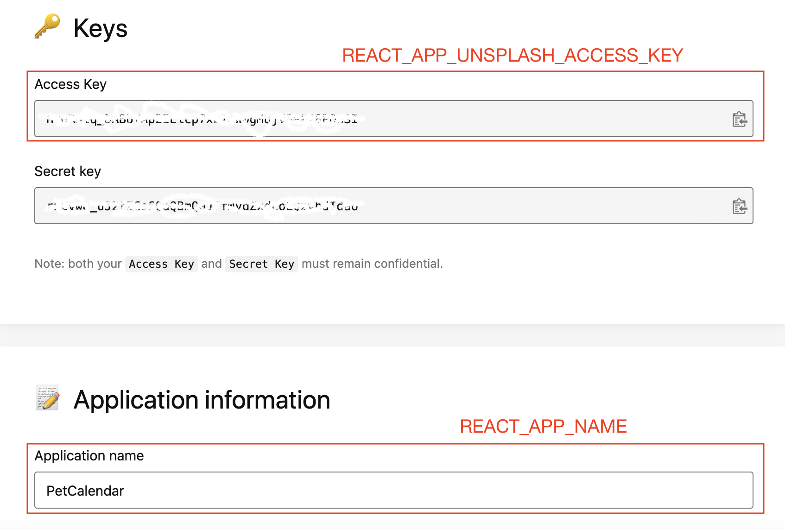

# PetCalendar

A calendar application that refreshes you with cute pet images.


## Run the APP

### Step 1: Unsplash API credential

To run the app on your local machine, you will first need to have an Unsplash API credential.
Go to the [Unsplash Image API](https://unsplash.com/developers) page and create a new Application.
Save the `Access Key` and the `Application Name`:



### Step 2: Create .env.development file

Create `pet-calendar/.env.development` file. In the file add:

```
REACT_APP_UNSPLASH_ACCESS_KEY='<The Access key from Step 1>'
REACT_APP_NAME='<The application name from Step 1>'
```

### Step 3: Run the Application

Run the following steps to start the application:

```
$ cd pet-calendar
$ npm install
$ npm run start
```

Now enjoy your pet calendar at http://localhost:3000/.
